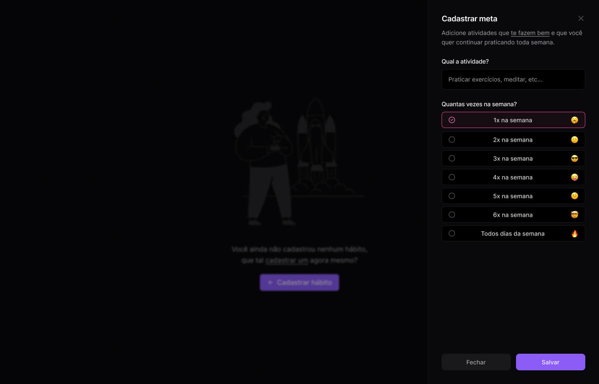
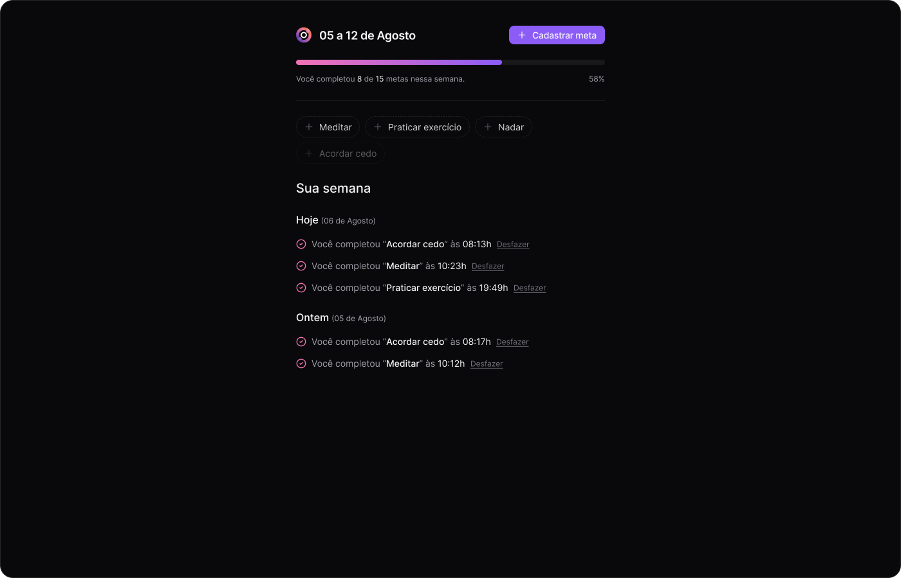

## NLW-Pocket 2024

### Intro

This app allows the user to setup and monitor the completion of weekly personal goals, such as "go to the gym", "eat healthy", etc. You can see the [design](<https://www.figma.com/design/rgwQTqaSQyFPn2RZDHG1Pw/NLW-Pocket-JS-%E2%80%A2-in.orbit-(Community)>) for reference. It was designed by [Rocketseat](https://www.rocketseat.com.br/) and developed, with some tweaks here and there by me.

This project is split into backend and frontend folders. Detailed instructions are available in the readme of each folder.

### Dependencies

1. [Node](https://nodejs.org/en): is required to process JavaScript code for both the backend and frontend.
2. [Docker](https://www.docker.com/): if you'd like to host your database in Docker, you should install it.
3. [VS Code](https://code.visualstudio.com/): the best source code editor for web development.

#### Recommended VS Code extensions

- [Tailwind CSS IntelliSense](https://marketplace.visualstudio.com/items?itemName=bradlc.vscode-tailwindcss) for Tailwind
- [Thunder Client](https://marketplace.visualstudio.com/items?itemName=rangav.vscode-thunder-client) for testing API calls
- [Prettier - Code formatter](https://marketplace.visualstudio.com/items?itemName=esbenp.prettier-vscode) multi-language code formatting
- [Prettier ESLint](https://marketplace.visualstudio.com/items?itemName=rvest.vs-code-prettier-eslint) multi-language code linting
- [Git Graph](https://marketplace.visualstudio.com/items?itemName=mhutchie.git-graph) for git tree visualization
- [Docker](https://marketplace.visualstudio.com/items?itemName=ms-azuretools.vscode-docker) UI for Docker visualization/actions
- [ES7+ React/Redux/React-Native snippets](https://marketplace.visualstudio.com/items?itemName=dsznajder.es7-react-js-snippets) code snippets

### Running

Fisrt setup the environment files (.env) similarly to the given .env.example file. In the backend we need the database connect string, and in the frontend we need the API (backend) URL, after that, run the following commands:

- Backend:

`docker compose up`
`npm i`
`npm run dev`

You should have it running on port 3333

- Frontend:

`npm i`
`npm run dev`

You should have it running on port 5173, accessible at [localhost](http://localhost:5173)

## Future work

This application can be enhanced in several ways. Some ssugestions are:

- Provide authentication with Google and/or GitHub;
- Navigation among weeks;
- Performance charts of goal completion;
- Sharing the week's performance with others.

Fell free to fork and extend this work.

## Lessons

Lessons (Portuguese only) from Rockeseat are available but not listed in Youtube:

- [Lesson 1](https://www.youtube.com/watch?v=d_UqdbV7SG4)
- [Lesson 2](https://www.youtube.com/watch?v=YH5eBYLSD0c)
- [Lesson 3](https://www.youtube.com/watch?v=JDCr3HqBOJc)

## License

This project is licensed under the MIT License - see the [LICENSE](./LICENSE.md) file for details.
